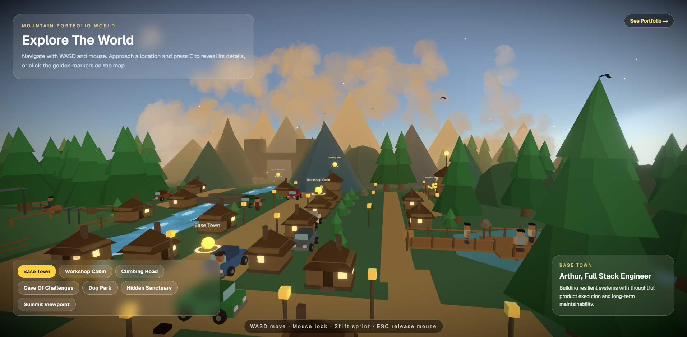

# Mountain Portfolio

> A cinematic 3D interactive portfolio — explore a mountain town to discover Arthur's career.

[](https://mountain-portfolio.vercel.app/)

---



---

## Built With


---

## Concept

Instead of a traditional scrollable portfolio, this is a **free-flight 3D world** built with React Three Fiber. The user spawns above the clouds and explores a stylized low-poly mountain town. Each zone tells part of Arthur's story — no forced text walls, just environmental storytelling.

**Visual style**: Low-poly, toon-shaded, warm palette. Inspired by Journey / Zelda BOTW / Monument Valley.

**Navigation**: WASD + mouse to fly freely. Shift to boost. The camera has no collision — fly through terrain, dive into valleys, orbit the peaks.

---

## World Map

| Zone | Content |
|------|---------|
| Spawn / Hero | Float above clouds, see the entire world |
| Base Town + Lower Town | About — warm, alive, full of characters |
| Dog Park | Human side — Laika, Kira, and family |
| East / Far Lake Viewpoints | Scenic wooden boardwalks over the lakes |
| Forest | Transition — bridge, river, dense trees |
| Workshop Cabin | Skills — React, Angular, Next.js, NestJS, Node, AWS |
| Climbing Road | Experience — professional timeline as trail milestones |
| Cave of Projects | Projects — gems and artifacts in a mountain cave |
| Sanctuary | Spiritual pause — faith and purpose narrative |
| Summit / Contact | Contact form as a glowing stone tablet at the peak |

Full world design, coordinates, and implementation status: **[WORLD_DESIGN.md](./WORLD_DESIGN.md)**

---

## Station Pages

Each world zone has a dedicated station page — a real Next.js route with scrollable content and a toon 3D diorama.

| Route | Station | Content |
|-------|---------|---------|
| `/station/base-town` | Base Town | About — intro |
| `/station/workshop-cabin` | Workshop Cabin | Skills — tech stack |
| `/station/climbing-road` | Climbing Road | Experience — timeline |
| `/station/cave-of-challenges` | Cave of Challenges | Projects |
| `/station/dog-park` | Dog Park | Human side — family |
| `/station/hidden-sanctuary` | Hidden Sanctuary | Faith — sanctuary |
| `/station/summit-viewpoint` | Summit Viewpoint | Contact — links |

**Architecture**: One `<Canvas>` in `layout.tsx`, persistent across all routes. The diorama cross-fades between stations. Station pages are real HTML — SEO indexable, recruiter-readable.

**Navigation**: Click a golden marker in the world → cinematic GSAP zoom → route transition → station page.

---

## Getting Started

```bash
pnpm install
pnpm dev
```

Open [http://localhost:3000](http://localhost:3000).

**Build for production**:
```bash
pnpm build
pnpm start
```

---

## Project Structure

```
src/
├── app/               # Next.js App Router — pages + layout
├── components/        # Shared presentational components
│   ├── WorldExplorer  # Main world controller (flight mode)
│   ├── SceneViewport  # R3F Canvas wrapper
│   ├── LoadingScreen  # Asset loading UI
│   └── MobileScene   # Static fallback for mobile
├── features/          # Domain feature modules (about, skills, experience…)
├── three/             # All R3F / Three.js code
│   ├── SceneManager/  # Root canvas orchestrator + DayNightController
│   ├── CameraController/
│   ├── AssetLoader/
│   ├── terrain/       # Ground, water, flora, bridges, caves, viewpoints
│   ├── characters/    # Arthur, Wife, NPCs, StreetCars
│   ├── atmosphere/    # BirdFlock
│   ├── audio/         # AudioSystem, procedural sounds
│   └── lighting/      # SanctuaryLight, GuidanceEffects
├── hooks/             # Custom React hooks
├── lib/               # Pure utilities (terrainHeight, toonGradient)
├── store/             # Zustand stores
├── styles/            # Global CSS, design tokens
└── types/             # Shared TypeScript types
```

---

## Architecture Rules

- `SceneManager` owns the R3F `<Canvas>` — one per page, never nested
- `CameraController` drives camera — no `OrbitControls` in production
- `AssetLoader` wraps `useGLTF` with Suspense + progress tracking
- `terrain/`, `characters/`, `lighting/` are isolated modules — no cross-imports
- All assets: glTF 2.0, Draco-compressed, textures ≤ 1024×1024 for mobile
- Shadows and postprocessing disabled on `window.innerWidth < 768`
- Every canvas scene lazy-loaded with `next/dynamic` and `ssr: false`

---

## Characters

| Character | Role |
|-----------|------|
| Arthur | Main avatar — white polo, developer |
| Laika | Companion dog |
| Kira | Companion dog |
| Wife | NPC at the Dog Park |
| GOD | Light-being NPC at the Sanctuary |

---

## CI/CD

GitHub Actions pipeline:

1. **Lint** — ESLint zero warnings
2. **Type-check** — `tsc --noEmit`
3. **Tests** — Vitest suite green
4. **Security audit** — `pnpm audit --audit-level=high`
5. **Build** — production build clean

Branch strategy:
- `main` → production (Vercel auto-deploy)
- `dev` / `develop` → staging + Vercel preview
- Feature branches: `feat/`, `fix/`, `chore/`

---

## Performance Targets

| Metric | Target |
|--------|--------|
| Lighthouse Performance (mobile) | ≥ 90 |
| Lighthouse Accessibility | ≥ 90 |
| Lighthouse SEO | ≥ 90 |
| LCP | < 2.5s |
| INP | < 200ms |
| CLS | < 0.1 |
| WCAG | 2.1 AA |
